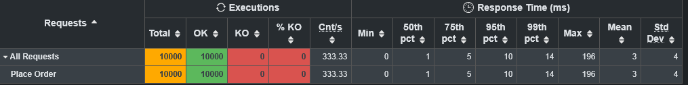
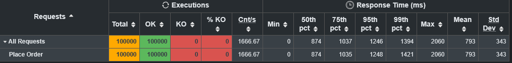
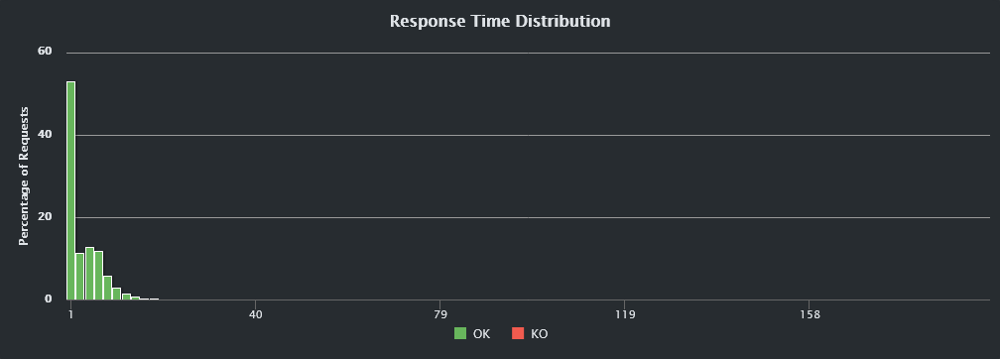
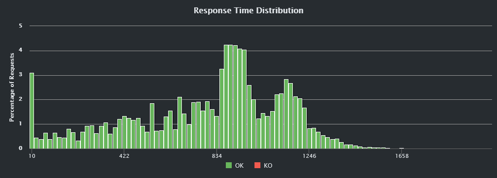
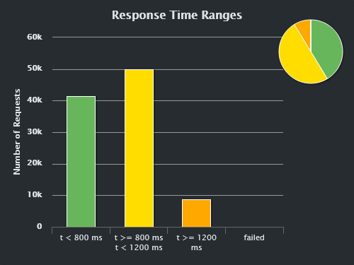
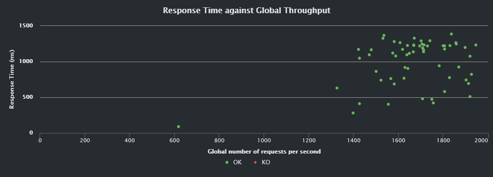

# Order Matching Engine

A single-instrument limit order book with price-time priority matching, exposed over a REST API with live WebSocket streaming of trades and book depth. Spring Boot 4.1 on Java 26, with executed trades persisted to PostgreSQL.

## What it does

Orders arrive over HTTP. The engine matches each incoming order against the opposite side of the book for as long as a price match exists, generating trades along the way. Whatever quantity is left over rests in the book waiting for a counter-order. Every trade is persisted and broadcast to subscribed WebSocket clients in real time.

The matching rules:

* **Price priority.** Buy orders are sorted highest-first and sell orders lowest-first, so the best price on either side is always the first entry.
* **Time priority.** Orders at the same price level sit in a FIFO queue, so the oldest resting order fills first.
* **Execution price.** A trade executes at the *resting* order's price rather than the incoming one, because the resting price was already committed to the book before the incoming order showed up.
* **Sequence numbers.** Each trade is stamped with a monotonic sequence number assigned under the write lock, so the true match order is still recoverable even if WebSocket broadcasts arrive out of order.

The book is guarded by a `ReentrantReadWriteLock`. Depth reads can run concurrently with each other, while submits and cancels take the write lock since they mutate the price-level maps.

## Architecture

```
HTTP  --->  OrderBookController  --->  OrderBookService  --->  OrderBook (engine)
                                            |                      |
                                            +---> TradeRepository ---> PostgreSQL
                                            |
                                            +---> SimpMessagingTemplate ---> /topic/trades
                                                                             /topic/book
```

| Layer | Responsibility |
| --- | --- |
| `controller/` | HTTP mapping, status codes, request records. Never constructs a domain `Order` itself. |
| `service/OrderBookService` | Owns the single shared `OrderBook` bean, builds validated orders, persists and broadcasts trades. |
| `engine/OrderBook` | Pure matching logic over a `TreeMap<BigDecimal, Deque<Order>>` per side. No Spring dependencies. |
| `model/` | `Order`, `Trade`, `OrderSide`. Validation lives in the constructors. |
| `repository/` | JPA `TradeEntity` and `TradeRepository`. |

Prices are `BigDecimal` throughout. There is no floating point anywhere in the matching path.

## API

| Method | Endpoint | Description |
| --- | --- | --- |
| `POST` | `/api/orders` | Place an order. Returns `201` with the assigned order id and any resulting trades. |
| `DELETE` | `/api/orders/{id}` | Cancel a resting order. `200` with the cancelled order, or `404`. |
| `GET` | `/api/orders/book` | Current book depth, aggregated quantity per price level, both sides. |
| `GET` | `/api/trades` | All persisted trades. |

Invalid input (null side, non-positive price or quantity) is rejected with a `400` and a structured error body via `@ControllerAdvice`.

Placing an order:

```bash
curl -X POST http://localhost:8080/api/orders \
  -H "Content-Type: application/json" \
  -d '{"side":"BUY","price":100.50,"quantity":25}'
```

```json
{
  "orderId": "3f2a...",
  "trades": [
    { "buyOrderID": "3f2a...", "sellOrderID": "9c11...",
      "price": 100.00, "quantity": 25, "timestamp": "...", "sequenceNum": 1 }
  ]
}
```

### WebSocket (STOMP)

Connect to `ws://localhost:8080/ws` and subscribe to:

* `/topic/trades` for every trade execution as it happens
* `/topic/book` for a full depth snapshot after every order placement or cancellation

## Running it

You'll need Java 26 and Docker for the database.

```bash
docker compose up -d          # PostgreSQL 16 on :5432
./mvnw spring-boot:run        # app on :8080
```

The schema is created automatically via `ddl-auto=update`. Actuator is on the classpath for health and metrics.

```bash
./mvnw test
```

Unit tests cover the engine's matching paths, the model constructors' validation, the controller layer, the repository, and the WebSocket config.

## Load testing

Load is generated with [Gatling](https://gatling.io). The simulation lives in [`OrderSubmissionSimulation.java`](src/test/java/com/nicholasp/ordermatchingengine/gatling/OrderSubmissionSimulation.java). Each virtual user fires 50 `POST /api/orders` requests back to back with a randomized side, price (95 to 105) and quantity (1 to 20). Every response has to come back `201` or Gatling counts it as a failure.

```bash
./mvnw gatling:test
```

### Results

Two runs against the same build on the same machine: a light run to establish a clean baseline, and a heavy run at 10x the load.

| Run | Users / Ramp | Requests | Failures | Throughput | p50 | p95 | p99 | Max |
| --- | --- | --- | --- | --- | --- | --- | --- | --- |
| Light | 200 / 30s | 10,000 | 0 | 333 req/s | 1 ms | 10 ms | 14 ms | 196 ms |
| Heavy | 2,000 / 20s | 100,000 | 0 | 1,667 req/s | 874 ms | 1,246 ms | 1,394 ms | 2,060 ms |

Light, 10,000 requests, 0 KO:



Heavy, 100,000 requests, 0 KO:



Throughput scaled 5x and the failure count stayed at zero in both runs. Under a 10x load increase the app degrades gracefully. It gets slower, but it doesn't error out or drop requests.

### Where the latency goes

The two response-time distributions show the shape of that degradation, and they're worth reading against each other. Note the x-axis scales: 1 to 158 ms versus 10 to 1,658 ms.



At 333 req/s the book is essentially free. Over half of all requests land in the first bucket, the whole distribution collapses into a spike under about 20 ms, and the thin tail is gone by 40 ms.



At 1,667 req/s the same work spreads into a bimodal curve. That spike at the far left is the start of the run before the ramp saturates, which is the light run's behavior still visible underneath. The two humps around 850 ms and 1,150 ms are the loaded steady state.



Bucketed, the heavy run puts roughly 41k requests under 800 ms and 50k between 800 and 1,200 ms, with a 9k tail beyond 1,200 ms and nothing at all in the failed column. The light run's equivalent chart is a single bar: 10,000 requests, all under 800 ms.



Latency climbs with concurrency and then flattens out between 1,400 and 2,000 req/s rather than running away. The system is saturating, not collapsing.

### What the numbers actually mean

Latency was highest early in the heavy run and improved as it went on, which points at JVM and connection-pool warm-up rather than sustained overload. The steady-state latency later in the run is the more representative figure.

The DB connection pool isn't the bottleneck. No HikariPool exhaustion warnings showed up in the server logs for the duration of the run.

The app is CPU-bound under load rather than blocked on locks or I/O. Per-process profiling showed one `java.exe` sustaining 80 to 90% CPU for exactly the duration of the heavy test and sitting idle before and after. That's consistent with real compute work (JSON serialization happening two to three times per trade, GC churn from object allocation) rather than threads waiting around on something.

### One caveat worth stating

The load generator and the application under test ran on the same machine, sharing CPU cores. Since the app is CPU-bound, Gatling was competing with it for exactly the resource that limits it, so the heavy-run latency figures are pessimistic and the throughput ceiling is understated. A properly rigorous benchmark would put the generator on a separate host.

## Known limitations

* Single instrument. The book has no symbol dimension.
* Limit orders only. No market, IOC, or FOK order types.
* The book lives in memory. Trades survive a restart, resting orders don't.
* `cancelOrder` scans both sides linearly to find an id. An id-to-order index would make it O(1).
